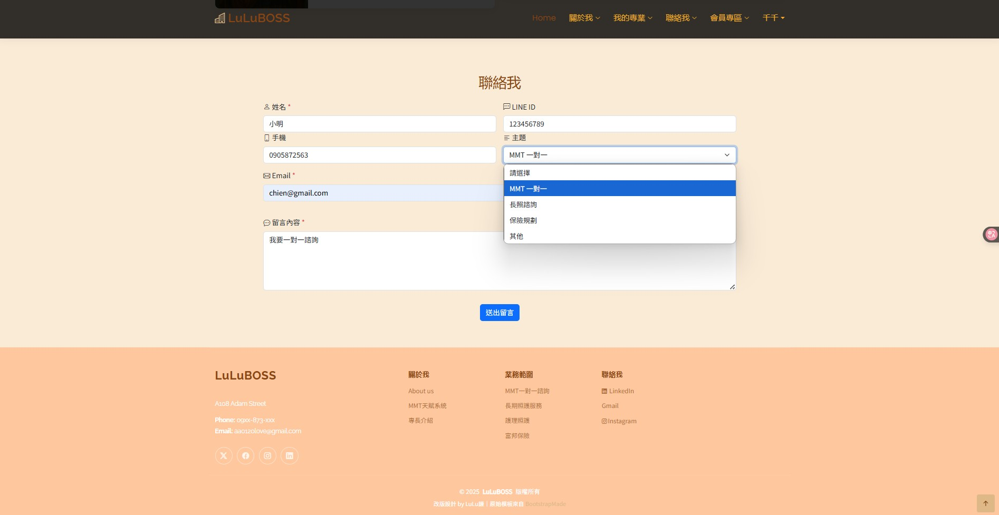

# 💼 SoulAdmin 個人專業網站 (Laravel 專案)

這是一個使用 Laravel 框架開發的個人網站平台，初衷是為了幫女友整合她的自我介紹、專業經歷與服務項目，同時也作為我學習 Laravel 的實戰練習。專案持續優化中，功能與模組會視需求持續擴充。

持續更新中..........................

## ✨ 網站介紹

-   **註冊與登入機制**

    -   點選註冊頁面申請帳號密碼
    -   系統驗證輸入資料正確性
    -   登入成功後依角色顯示「會員專區」或「後台專區」

-   **會員專區**

    -   一般使用者登入後導覽列顯示會員功能

-   **前台網頁預覽**
    -   首頁
    -   
    -   點選註冊，申請帳號密碼
    -   
    -   驗證輸入資料是否有錯誤
    -   [驗證](public\assets\img\verify.png)
    -   一般會員登入成功後，導覽列會顯示會員專區
    -   
    -   網頁預覽
    -   
    -   
    -   
-   **聯絡我表單**
    -   使用者可填寫表單留言，資料自動儲存至資料庫
    -   管理員可於後台查看與管理留言紀錄
    -   
    -   
-   **後台登入與管理功能**
    -   登出後可切換管理員帳號登入
    -   系統自動判斷登入者身份並導入對應後台
    -   
    -   登入後導覽列會顯示後台專區，進入後來到後台
    -   
    -   後台預覽
    -   
    -   

## 🔧 專案架構特色

-   使用 **Laravel 10.x** 開發
-   前台版型參考 [BootstrapMade - NiceSchool](https://bootstrapmade.com/nice-school-bootstrap-education-template/)
-   前後台登入系統與導覽列整合：
    -   登入、註冊、驗證密碼
    -   登入後依身份切換導覽列內容：
        -   管理員顯示「後台專區」
        -   會員顯示「會員專區」
-   完整後台管理系統模組：
    -   員工管理（Manager） (增加 / 刪除 / 修改 / 查詢)
    -   專業分類管理（MajorCategory） (增加 / 刪除 / 修改 / 查詢)
    -   專業內容管理（Major） (增加 / 刪除 / 修改 / 查詢)
    -   會員管理（Player）編輯 / 刪除 / 查詢
    -   聯絡我留言管理（Contact）編輯 / 刪除 / 查詢
-   使用中介層 Middleware 驗證後台登入權限
-   使用 Session 判斷登入身份，顯示對應選單項目
-   Blade 模板引擎整合，Controller 與 Route 結構清晰

## ⚙️ 使用技術

-   Laravel Blade + Controller
-   Bootstrap 5 + 客製 SCSS
-   SQLite（原為 MySQL，改為 SQLite 方便測試與部署）
-   SweetAlert 提示訊息
-   Glightbox 圖片燈箱展示

## 🧪 開發環境與限制

-   僅於本地端環境（XAMPP + SQLite）測試
-   尚未部署至線上環境（無綁定網域與伺服器）
-   資料透過 SQLite 儲存，免額外設定資料庫帳密

## 🗂️ 專案路徑說明

-   前台首頁：`resources/views/front/index.blade.php`

-   後台入口：`/admin/home`（登入後自動導入）
    -   僅當 `session('role') === 'admin'` 才顯示後台入口連結
    -   玩家登入後僅能看到自己的「會員專區」

---

> 本專案為學習與練習之用，尚未開放商業用途與公開託管部署。
