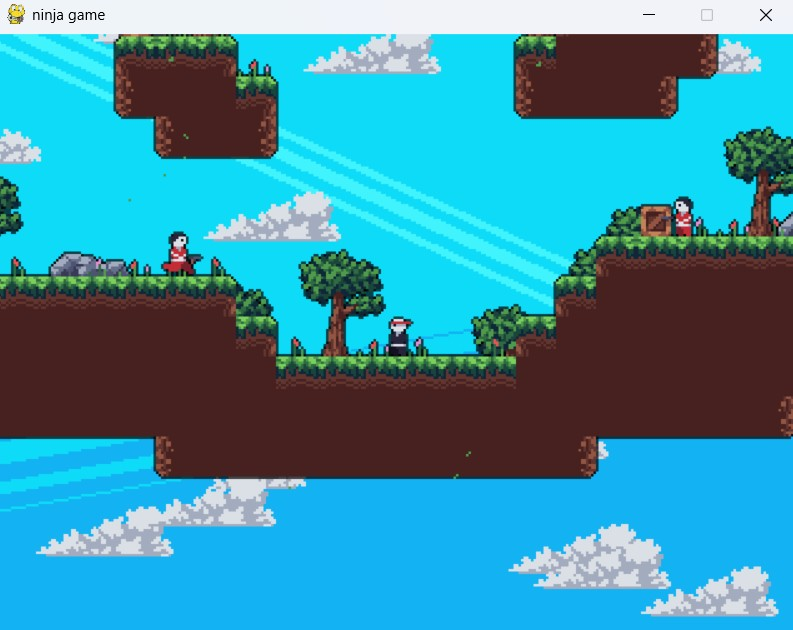
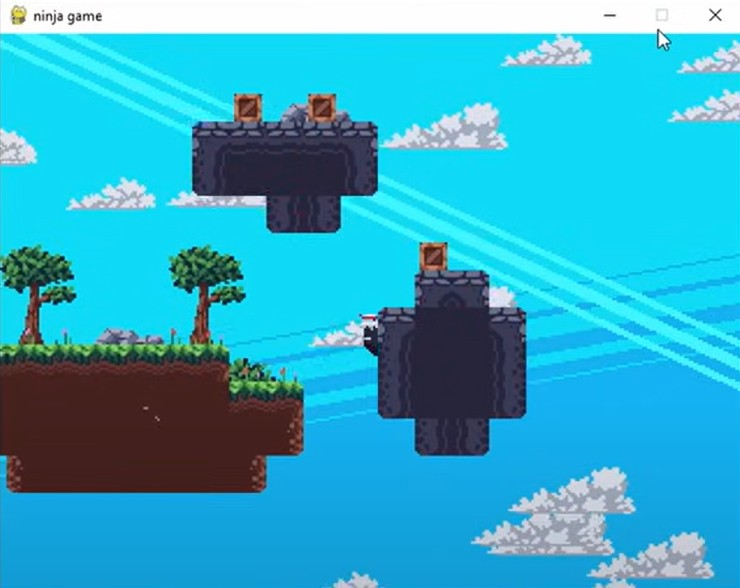
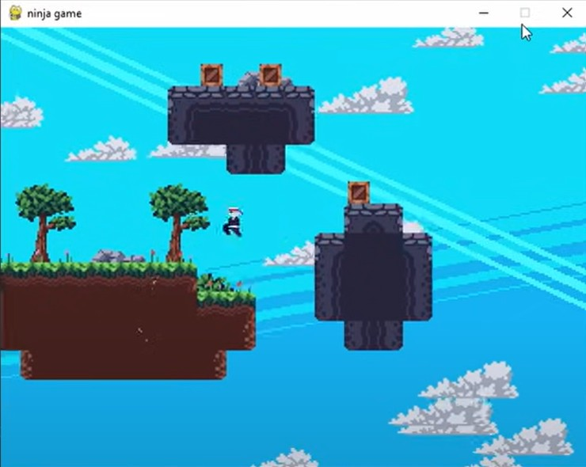
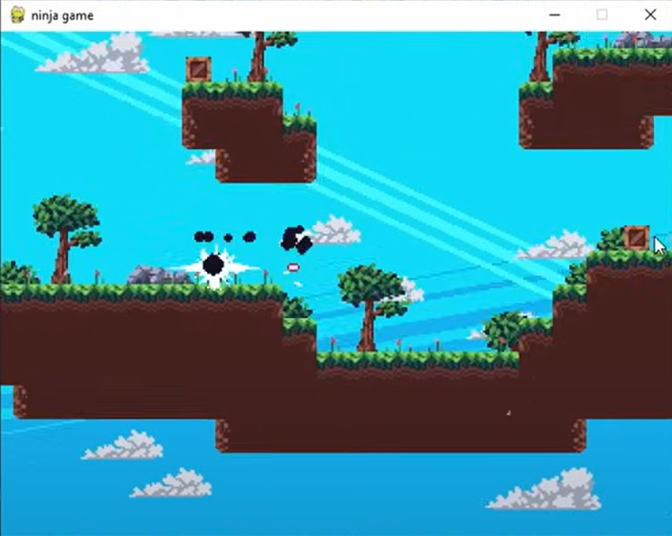
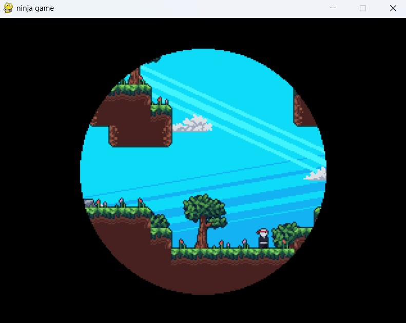

# 🥷 Ninja Game

這是一款使用 **Python + Pygame** 製作的 2D 橫向動作遊戲。  
玩家將扮演一名忍者，闖關、跳躍、閃避子彈並擊敗敵人。

遊戲特色在於：  
**牆壁滑行、粒子特效、畫面遮罩、槍擊效果** 的整合與細節打磨。

---



## 🎮 遊戲玩法與操作

| 操作鍵 | 功能說明            |
| ------ | ------------------- |
| ← / →  | 左右移動            |
| ↑      | 跳躍（可瞪牆跳）    |
| X      | 衝刺（閃避 / 攻擊） |

---

## 💡 特殊機制

- 🧗 **牆面滑行**：角色接觸牆面時將自動慢速滑行，可進行 **蹬牆跳**。
  
  

- 💥 **火花擊中特效**：角色死亡或被擊中會產生粒子 + 視窗震動。
  
- 🍂 **自然粒子效果**
- 🎯 **敵人與子彈攻擊**：需靈活使用跳躍與衝刺躲避。
  

- 🚪 **自動關卡切換**：敵人全滅後自動過渡到下一層。
  

---

## 🛠️ 程式特色

- 🔄 使用自訂 `Animation` 類別管理角色動作序列。
- 🗺️ 支援 JSON 地圖檔，搭配 `Tilemap` 系統編輯關卡。
- 🧱 建立遮罩系統（`pygame.mask`）產生角色剪影與光影感。
- 🔄 `transition` 橫向轉場效果強化過關體驗。
- 🧩 模組化結構（如：`entities.py`, `utils.py`, `tilemap.py`），利於維護與擴充。

---

## 🐞 Bug 修復紀錄：Wall Slide 空中死亡修正

### 🔧 問題描述：

玩家在 **牆壁滑行中仍會因空中滯留時間過久導致死亡**。

### 🔨 修正前（`entities.py`）：

```python
if self.air_time > 120:
    if not self.game.dead:
        self.game.screenshake = max(16, self.game.screenshake)
    if not self.wall_slide:
        self.game.dead += 1
```

### 🔨 修正後（`entities.py`）：

```python
if self.air_time > 120 and not self.wall_slide:
    if not self.game.dead:
        self.game.screenshake = max(16, self.game.screenshake)
        self.game.dead += 1

- 並加入

self.air_time = min(self.air_time, 50)
self.air_time -= 0.5  # 持續降低空中滯留幀數

```

感謝 DaFluffyPotato Youtuber 的 Pygame 教學
