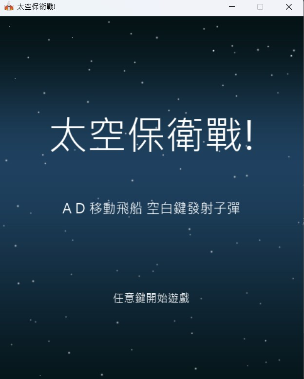
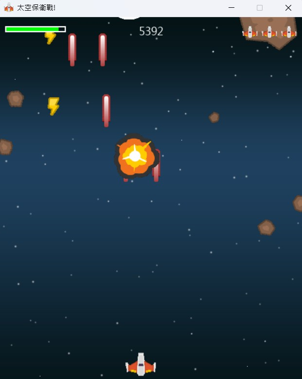
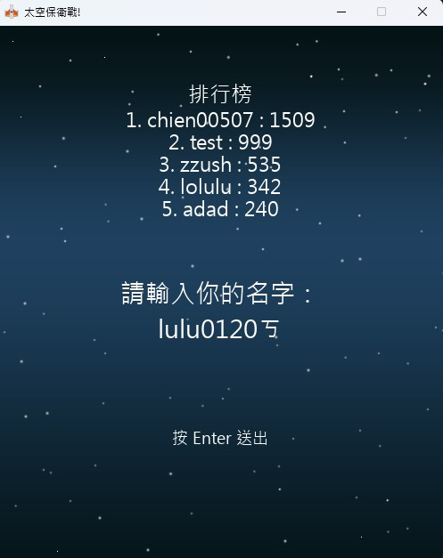

# 太空保衛戰！🚀

2D 太空射擊遊戲，玩家要操控太空船射擊墜落的隕石，並躲避攻擊來生存下去。
使用 **Pygame + MySQL + PHP（XAMPP）** 製作的 2D 太空射擊遊戲，結合了本地遊戲操作與 **排行榜上傳功能**。





## 🎮 遊戲玩法

- **移動控制：**

  - A 鍵：向左移動
  - D 鍵：向右移動

- **攻擊方式：**

  - 空白鍵：發射子彈

- **強化系統：**

  - 撿到「閃電」可提升子彈等級（最多兩槍同時發射）
  - 撿到「護盾」可恢復血量

- **生命值與命數：**

  - 左下角顯示血量條（HP）
  - 右上角顯示剩餘命數（會復活）
  - 命數耗盡即 Game Over

  ## 🏆 分數排行榜系統（MySQL + PHP）

- 每局遊戲結束後可輸入玩家名稱
- 分數會自動上傳至資料庫 `spacedefense.scores`
- 會顯示排行榜前 5 名
- 使用 Python `requests` 模組與後端 PHP 溝通

📌 資料表結構：

```sql
CREATE TABLE scores (
    id INT AUTO_INCREMENT PRIMARY KEY,
    name VARCHAR(50) NOT NULL,
    score INT NOT NULL,
    creaTime TIMESTAMP DEFAULT CURRENT_TIMESTAMP
);

## 🖼️ 遊戲素材

- 所有圖片放在 `img/` 資料夾中，包含背景、玩家飛船、子彈、隕石、爆炸動畫等。
- 音效與背景音樂放在 `sound/` 資料夾中。
- 字型檔案放在專案根目錄。
```
