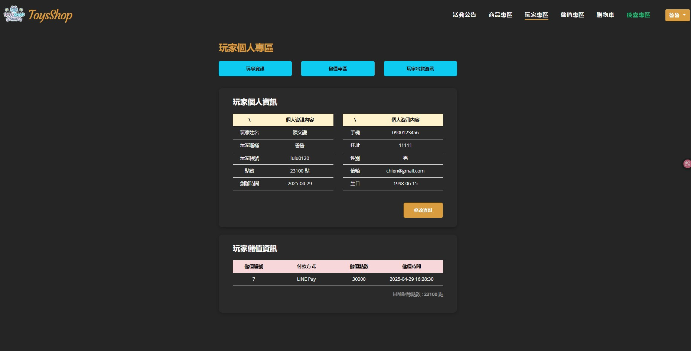

# 🛍 ToysShop 後台抽獎系統

## 📌 專案簡介

這是一個使用 Laravel 建立的後台抽獎管理系統，具備商品新增、抽獎設定、抽獎執行與歷史紀錄等功能，支援動態畫面與視覺化提示。

## 🔧 技術使用

-   Laravel + PHP
-   MySQL 資料庫
-   Bootstrap、HTML5、CSS3、JavaScript
-   Axios 串接 API
-   SweetAlert2 提示框、Lightbox 圖片展示
-   Git / GitHub 版本控制

## 🧩 我的職責與貢獻

在本專案中，我負責開發前台商品頁與抽獎展示功能，主要參與的程式區塊與模板頁面包括：

### ➤ 開發區域

-   `app/Http/Controllers/Front/ProductController.php`：  
    商品頁邏輯控制與資料處理。

-   `resources/views/front/product/prodictAllList.blade.php`
-   `resources/views/front/product/prodictCategoryList.blade.php`
-   `resources/views/front/product/prodictList.blade.php`：  
    三個商品列表畫面設計與資料呈現。

-   `routes/front/product.php`：  
    商品模組路由設定與功能導向。

### ➤ 我的工作內容

-   設計前台商品抽獎頁面 UI 與抽獎邏輯流程
-   實作抽獎結果篩選（避免重複中獎）
-   使用 SweetAlert2 顯示中獎提示，改善使用者體驗
-   串接 API 顯示商品資料，並處理圖片展示錯誤等問題
-   協助除錯與調整商品資料顯示問題

### 🛠 實際開發中曾遇到的問題與解法

在開發抽獎流程時，曾遇到一個情境問題：當使用者尚未登入就點擊「抽獎」，系統會正確導向登入頁並提示需登入，但使用者登入後，**無法導回原本的商品抽獎畫面**，導致畫面無資料、頁面錯誤。

經除錯後發現，原先 `ProductController` 中的 `lottery` 方法未能保留之前選取的商品資料，加上路由使用 `GET`，無法正確讀取原請求的資料。  
後來我們調整了以下邏輯：

-   **改為使用 `any` 方法接收路由**（接受 GET/POST 都可處理）
-   **調整 Controller 的參數處理方式**，讓登入後可正確取得商品資料與頁面狀態

這段過程雖然花了一些時間，但讓我實際學到 Laravel 路由處理與登入後導向邏輯的應用，對 MVC 架構中「狀態傳遞」與「流程維持」的理解也更進一步。

###### 📷 專案畫面

### 商品列表

 ## 目前沒有接金流

### 抽獎介面（含 SweetAlert2）

## 🚀 專案執行方式

⚠️ 本專案為團隊合作實作作品，需搭配專用資料庫方能完整執行。  
由於資料庫內容含開發期間測試資料，目前無法直接對外公開執行版本，  
可參考上方畫面截圖與程式碼了解功能實作內容。
